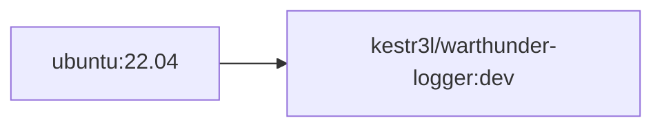

# CONTAINER FOR LOGGING STATES FROM WAR THUNDER

## 0. OVERVIEW

- This repository contains code for building a container that logs [War Thunder](https://warthunder.com/en) state data.
- It utilizes the Python library `WarThunder`.
- Logged data will be saved in CSV format as `write.csv`.
- A prebuilt image is available on [Docker Hub](https://hub.docker.com/r/kestr3l/warthunder-logger).

## 1. AVAILABLE IMAGES & BUILD ORDERS

### 1.1. IMAGE AVAILABILITY

|TAG|ARCH|AVAILABILITY|Misc.|
|:-|:-|:-:|:-|
|`dev`|AMD64|✅|-|

### 1.2. BUILD ORDERS



## 2. ENVIRONMENT VARIABLE SETUPS

### 2.1. ENVIRONMENT VARIABLE SETTINGS LIST

|VAR|DESCRIPTION|EXAMPLE|Misc.|
|:-|:-|:-|:-|
|`HOST_IP_ADDR`|Private IP of a host running War Thunder.<br/>This IP must be accessible from the Docker host.|172.16.0.1|-|

### 2.2. VOLUME MAPPING SETTINGS LIST

|CONTAINER DIR|DESCRIPTION|HOST DIR EXAMPLE|Misc.|
|:-|:-|:-|:-|
|`/home/user/data`|Data directory where `.csv` file is saved.|`/home/user/data`|-|
|`/usr/local/bin/entrypoint.sh`|Container entrypoint|`/home/user/entrypoint.sh`|Use for overriding|

## 3. HOW-TO-BUILD

```bash
DOCKER_BUILDKIT=1 docker build \
--build-arg BASEIMAGE=ubuntu \
--build-arg BASETAG=22.04 \
-t kestr3l/warthunder:dev \
-f ./Dockerfile .
```

## 4. HOW-TO-RUN

- Obtain the private IP address of the host running War Thunder.
- To make logged data persistent, set the data directory and map it accordingly.
- A template for the `docker run` command is suggested as follows:

```shell
docker run -it -d --rm --net host \
-e HOST_IP_ADDR=<PRIVATE_IP_OF_HOST> \
-v <DIR_TO_SAVE_DATA>:/home/user/data \
--name warthunder-logger \
kestr3l/warthunder:dev
```